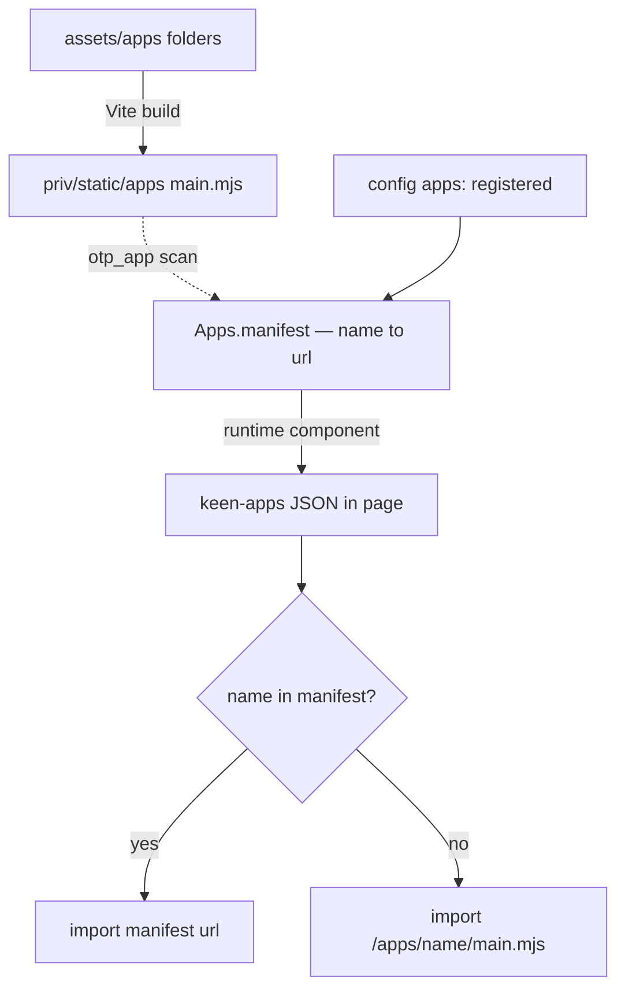
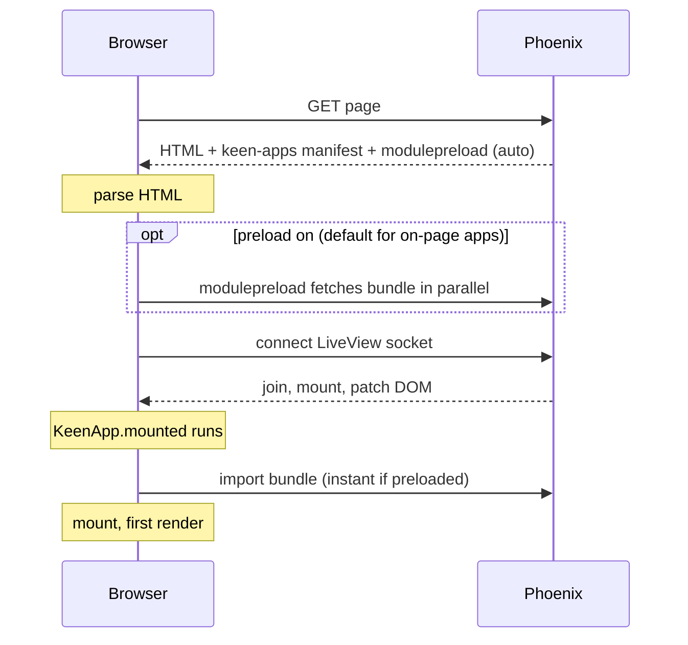

# External apps: CDNs, a registry, and `:direct` vs `:proxy`

By default an island is *local*: `AppsManager` imports `/apps/<name>/main.mjs`
from your own static path and you configure nothing. Register an app only when
its compiled bundle lives **elsewhere** — a shared CDN, another team's deploy, or
a database-driven catalogue.

> This guide is about *where the bytes come from*. It assumes the bundle is already
> an island — it follows the [mount contract](authoring-apps.md#the-mount-contract)
> and is built to be embeddable. A third-party bundle that owns the page (auto-mounts,
> absolute asset paths, page globals) can't be proxied into an island; see
> [Island-able vs page-owning apps](packaging-apps.md) for how to tell, and what to
> do instead.

## How an app's URL is resolved

Two sources feed **one** `name → url` manifest, and the client reads it to decide
where to `import()` each bundle. **Local** apps are discovered by folder at build
time; **registered** apps come from config (registered wins on a name clash):



*(local folders and registered config merge into one manifest — registered wins on
a name clash; the "no" branch is the convention fallback when `:otp_app` is unset.)*

The fallback exists so local apps work **even without** `:otp_app` — the client
derives the same `/apps/<name>/main.mjs` URL by convention. Setting `:otp_app` just
lifts local apps *into* the manifest, so they're visible server-side (for
[`preload`](KeenPhoenixSvelte.html#runtime/1-preloading-bundles) and tooling)
instead of only being resolvable by the naming convention.

## When the bundle actually loads

Without preloading the bundle is fetched **lazily** — the `import()` runs in the
hook's `mounted()`, which on a LiveView can't happen until the socket connects and
the view mounts, so the download starts well into the page load. By default
`<KeenPhoenixSvelte.runtime>` preloads the bundles for the islands **on this page**
(`preload={:auto}`), moving the *download* (not the render) up to initial HTML
parse:



> Preloading is automatic and page-scoped: each `<.app>` records itself as it
> renders and `<.runtime>` emits `<link rel="modulepreload">` for exactly those
> bundles. Opt out with `preload={false}`, or override with an explicit list — see
> [`runtime/1`](KeenPhoenixSvelte.html#runtime/1-preloading-bundles).

## First render: LiveView vs a plain page

Preloading moves the *download* early, but on a LiveView the *render* still waits
for the socket. It helps to separate the two loads a first LiveView hit does:

1. **Dead render (HTTP).** The first request is plain HTTP. The LiveView runs
   `mount/3` (`connected?(socket) == false`) and `render/1` on the server and
   returns a **complete HTML page** — painted immediately. Each `<.app>` div is in
   that HTML *with its `<:placeholder>` skeleton*, because the wrapper is
   server-rendered and `phx-update="ignore"`. The island itself is **not** here:
   this library does no SSR, so the Svelte app is client-only.
2. **Connected render (WebSocket).** `liveSocket.connect()` opens the socket, the
   server runs `mount/3` **again** (`connected?(socket) == true`) and patches the
   DOM. Only *after* that patch do hooks fire — so `KeenApp.mounted()` (and thus
   the island `import()` + first paint) happens here, not on the initial HTML.

So on a LiveView page the user sees a **full page with a placeholder** instantly,
and the island content swaps in **after the socket connects**. That connect +
mount round-trip — not the bundle, which preloading already has cached — is the
bulk of the delay between "bundle loaded" and "first render".

A **plain (non-LiveView) page** has the same dead render, but no connected phase:
[`mountStatic()`](authoring-apps.md) swaps the placeholder for the island the
instant the deferred `app.js` parses — no socket to wait for. Same app, same
bytes, earlier paint. The island mounts with [`live: null`](server-communication.md#the-app-boundary)
and reaches the server over `api` / `channel` instead.

The example app demonstrates the difference directly: **`/proxying`** (a LiveView)
and **`/proxying-plain`** (a plain controller page) render the *same* two islands
with an in-browser load-stats panel, so you can compare the `first render` delta
side by side. The island that needs the `live` bridge pays for the connect; one
that doesn't can live on a plain page and skip it.

### Eager mounting: paint before connect, on a LiveView

You don't have to move an island to a plain page to skip the connect wait.
[`<.app eager>`](KeenPhoenixSvelte.html#app/1-eager-mounting) mounts the island on
a LiveView page via the same early `mountStatic()` path — it paints at `app.js`
parse time, then the hook upgrades it with the `live` bridge once the socket
connects (firing [`keen:live-ready`](server-communication.md#livestatus-and-eager-mounting)).
So you get the plain-page first-paint *and* keep `live`:

```heex
<.app name="dashboard" id="dash" eager props={%{unit: @unit}} />
```

| mode | first paint | `live` at first paint |
| --- | --- | --- |
| default | after socket connect | yes (`liveStatus: "ready"`) |
| `eager` | at `app.js` parse | no — arrives on connect (`"pending"` → `keen:live-ready`) |

**When it's safe (and when it isn't).** Eager suits an island whose first render
doesn't depend on `live` — e.g. one that fetches from `api`, joins a `channel`, or
calls **a different server entirely** (its own REST endpoint, a CDN, a third-party
API). Those transports are available immediately, connect or not, so mounting
early costs nothing. An island that must `pushEvent` to *this* LiveView just to
draw its first frame should stay on the default path (or show a loader while
`liveStatus === "pending"`). On a plain page `eager` is a no-op — there is no
`live` there at all (`liveStatus: "none"`).

The **`/eager`** page in the example mounts the same island both ways side by side,
with the load-stats panel, so you can watch the eager copy paint first and turn
"live" a moment later.

## The one thing that changes: the URL

`AppsManager.resolve(name)` decides where to import a bundle from. The server
emits a `name → url` **manifest** into the page (via
`<KeenPhoenixSvelte.runtime>`, read from `#keen-apps`); registered apps import
from that URL, everything else falls back to the base path. So the entire
external-app story is *"put the right URL in the manifest."*

```elixir
config :keen_phoenix_svelte,
  apps: %{
    "org-chart" => "https://cdn.acme.com/islands/org-chart@1.4.2/main.mjs"
  }
```

```heex
<.app name="org-chart" id="org-chart" props={%{unit: @unit_id}} />
```

The registry is just data — build the same map from a database at runtime and set
it with `Application.put_env(:keen_phoenix_svelte, :apps, map)`; it's read per
request.

## Mode of operation: `:direct` vs `:proxy`

Because `import(url)` runs in the **browser**, the URL decides *who fetches the
bytes*. That's the only real choice, and it's a config value:

```elixir
config :keen_phoenix_svelte,
  load_mode: :proxy,            # :direct (default) | :proxy
  proxy_path: "/apps"           # must match your router forward (defaults to /apps)
```

| | `:direct` | `:proxy` |
|---|---|---|
| Who fetches | Browser → CDN | Browser → your app → CDN |
| Manifest URL | the CDN URL | `"/apps/<name>"` (same-origin) |
| CORS | **required** on the CDN | none |
| CSP | must allow the CDN in `script-src` | `script-src 'self'` |
| Auth / gating / SRI | hard (public, cross-origin) | easy (you serve it) |
| Server load | none (CDN edge-caches) | in the path → cached + revalidated (`ProxyCache`) |

`:proxy` is the corporate-friendly default: it turns a cross-origin bundle into a
first-party asset, sidestepping CORS and a strict CSP. It needs the proxy plug:

```elixir
# router.ex
forward "/apps", KeenPhoenixSvelte.Apps.Proxy
```

`KeenPhoenixSvelte.Apps.Proxy` resolves `/apps/<name>` to the registered
upstream URL, fetches it (built-in `:httpc`, or an injectable `:app_provider`),
and caches it in ETS — see `KeenPhoenixSvelte.Apps.ProxyCache`.

The cache **revalidates** rather than pinning forever: a stale entry triggers a
single-flight conditional `GET` (`If-None-Match`/`If-Modified-Since`), so a `304`
costs nothing and a `200` swaps the bytes in. Freshness follows the upstream's
own `Cache-Control`/`ETag` when present, and a `:ttl` (default 5 min) otherwise —
so this works for **unversioned** upstreams (`.../server-status.js`) that can't be
busted by URL, not just versioned ones. Tune it globally or per app:

```elixir
config :keen_phoenix_svelte,
  proxy_cache: [
    ttl: :timer.minutes(5),   # fallback when the origin sends no cache directives
    respect_upstream: true,   # honor upstream Cache-Control / ETag / Last-Modified
    client_cache_control: "public, max-age=60, stale-while-revalidate=300",
    # what `immutable: true` emits (defaults to a 1-year immutable string):
    immutable_cache_control: "public, max-age=31536000, immutable"
  ],
  apps: %{
    # a truly versioned, immutable URL can skip revalidation entirely:
    "org-chart" => %{url: "https://cdn.acme.com/org-chart@1.4.2/main.mjs", immutable: true},
    # a bare, unversioned file is re-checked every minute:
    "status" => %{url: "https://cdn.acme.com/status.js", ttl: :timer.minutes(1)},
    # an explicit per-app browser Cache-Control wins over everything:
    "hourly" => %{url: "https://cdn.acme.com/hourly/main.mjs", client_cache_control: "public, max-age=3600"}
  }
```

The browser-facing `Cache-Control` is resolved most-specific-first: a per-app
`client_cache_control:` string, else a per-app `immutable: true` (emitting the
global `immutable_cache_control`, or a built-in 1-year immutable string), else the
global `client_cache_control`, else the built-in default. The proxy also forwards
an `ETag` and answers the browser's `If-None-Match` with a `304`, so the browser →
Phoenix → origin conditional chain revalidates cheaply end-to-end.

Per-app override, if some apps should stay direct:

```elixir
apps: %{
  "org-chart" => %{url: "https://cdn.acme.com/.../main.mjs", mode: :direct},
  "report"    => "https://reports.internal/report/main.mjs"   # uses load_mode
}
```

## Multi-file bundles: a base-path app

Some bundles aren't a single self-contained module — a vendor player might ship a
JS entry **plus** a separate stylesheet, fonts, or images. Point the registry at
the upstream **directory** with `base:` (and, if the entry isn't `main.mjs`, an
`entry:`), and every sub-path proxies through one registration:

```elixir
config :keen_phoenix_svelte,
  load_mode: :proxy,
  apps: %{
    "player" => %{base: "https://cdn.acme.com/player@3/", entry: "player.mjs"}
  }
```

The client imports the entry (`/apps/player/player.mjs` in `:proxy` mode), and any
sibling the bundle references re-serves same-origin under the same prefix:

| Request | Proxied to upstream |
|---|---|
| `/apps/player/player.mjs` | `https://cdn.acme.com/player@3/player.mjs` |
| `/apps/player/player.css` | `https://cdn.acme.com/player@3/player.css` |
| `/apps/player/fonts/x.woff2` | `https://cdn.acme.com/player@3/fonts/x.woff2` |

Each file is typed by its extension (`.mjs`/`.js` → `text/javascript`, `.css` →
`text/css`, otherwise `MIME`), while JS is always forced to a module-friendly type
regardless of what the origin reports. `..` and other unsafe segments are rejected
before any upstream fetch. Every file shares the app's cache/revalidation and
`ttl` / `immutable` / `client_cache_control` settings. A single-file app (`url:`)
is unchanged — it's just the one-file case.

> A bundle whose entry doesn't ESM-`export default` a mount function (e.g. a UMD
> build that sets `window.SomethingCreate`) still can't mount directly — write a
> thin adapter entry that imports the vendor files (now same-origin) and adapts
> them to `(target, opts) => { setProps, destroy }`. Base-path proxying is what
> gets all those files delivered.

### A code-split app (many chunks)

The same base-path registration handles your **own** app when it's big enough to
code-split — a dashboard that lazy-loads routes, say, whose build emits
`main.mjs` plus a pile of hashed `chunk-*.js`, CSS, and assets. Register the
output **directory**, not the single entry file:

```elixir
config :keen_phoenix_svelte,
  load_mode: :proxy,
  apps: %{
    # remote: the whole build directory on a CDN…
    "huge-app-3000" => %{base: "https://cdn.acme.com/huge-app-3000@2/", entry: "main.mjs"},
    # …or local: a directory the Phoenix node can see (entry may be a glob).
    "dash" => %{dir: "/srv/apps/dash", entry: "main.mjs"}
  }
```

The one thing that makes or breaks it is **where the chunk URLs point**. The
browser requests each chunk at whatever URL your bundler baked into the entry, so
that URL has to resolve back under `/apps/huge-app-3000/` for the proxy to see it:

- **Set the bundler's base** to the app's proxy prefix — Vite `base:
  "/apps/huge-app-3000/"` (Rollup `output.dir` + a matching public path). Then a
  dynamic `import("./chunk-x.js")` fetches `/apps/huge-app-3000/chunk-x.js`, which
  `resolve/1` matches on the first segment and proxies to `<base>/chunk-x.js`.
- **Or keep references relative** to the module — `new URL("./chunk-x.js",
  import.meta.url)` — which resolves against the served location automatically, no
  build-time base needed.

If instead the build hard-codes an absolute path (`/assets/…`) or a different
origin, those requests never reach this proxy and 404 (or leak cross-origin).
Registering the app single-file (`url:`) has the same effect — only the exact name
resolves, so every chunk 404s. `base:` / `dir:` is what opens the whole prefix.

Once the URLs line up, nothing else is special: each chunk is typed by its
extension, rejected if it contains `..`, and shares the **one** registration's
cache — its `ttl` / `immutable` / `client_cache_control`. In `:direct` mode the
chunks load straight from the CDN relative to `main.mjs` instead (no proxy in the
path) — same code-splitting, just cross-origin.

### Restricting to a manifest (`manifest:`)

A `base:`/`dir:` app proxies **any** sub-path under its prefix — including ones
that don't exist. That's not a security hole (the host is fixed by config; `..` is
rejected), but an unauthenticated client can still make you fetch a stream of
guaranteed-miss paths (`/apps/huge-app-3000/does-not-exist-N.js`). Two bounds are
always on: concurrent upstream fetches are capped (`proxy_cache:
[max_concurrent_fetches: 32]`), and a definitive upstream 404 is briefly
remembered (`negative_ttl`, default 10s) so the same miss isn't re-fetched.

To close it completely, hand the app the **exact list of files it ships** — then
anything else is a `404` decided locally, *before* any upstream fetch:

```elixir
apps: %{
  # inline — you know the file set up front:
  "player" => %{base: "https://cdn.acme.com/player@3/",
                manifest: ["player.mjs", "player.css", "fonts/inter.woff2"]},

  # or point at a file in the bundle — fetched + cached like any asset, re-parsed
  # only when it changes:
  "huge-app-3000" => %{base: "https://cdn.acme.com/huge-app-3000@2/",
                       manifest: "keen-manifest.json"}
}
```

Every entry is a sub-path **relative to the app's `base:`** (the part after
`/apps/<name>/`), matched exactly after normalization (leading `./` or `/` and
surrounding whitespace are stripped; nested folders like `assets/fonts/x.woff2`
are fine at any depth). The declared `entry:` and the manifest file itself are
always allowed even if absent. If the manifest can't be loaded it **fails open**
(reverts to the always-on bounds above), so a transient CDN blip never 404s your
whole app.

A `manifest:` string is fetched, cached like any asset, and re-parsed only when it
changes. The parser accepts three shapes, auto-detected:

- **flat JSON array** — `["main.mjs", "assets/x.js"]`. This is the *custom format*;
  generate it with the plugin below.
- **Vite `manifest.json`** — the object Vite emits with `build.manifest: true`. All
  string leaves (`file`/`css`/`assets`/…) are pulled out automatically, so you can
  point straight at `.vite/manifest.json` with no transformation.
- **newline text** — one path per line, `#` comments and blank lines ignored.

#### Which format? — the `public/` gap

Vite's own `manifest.json` only lists what's in the **module graph**: entry
chunks, code-split chunks, and assets *imported* from JS/CSS. Files Vite copies
verbatim from **`public/`** (favicons, fonts you drop in, images referenced only
by a runtime-built URL) never appear in it — so a strict Vite manifest would `404`
them. If your app serves any `public/` assets, use the **custom format** instead:
it's generated by scanning the finished output directory, so it captures
*everything that ships*, graph or not.

#### Generating the custom manifest

Ship it from your build with the bundled Vite plugin — it walks `outDir` in the
final `closeBundle` hook (after `public/` is copied) and writes a sorted flat
array to `keen-manifest.json`:

```js
// assets/apps.vite.config.js
import { defineConfig } from "vite"
import { appConfig } from "@keenmate/phoenix_svelte/vite"
import { keenManifest } from "@keenmate/phoenix_svelte/vite/manifest"

export default defineConfig(({ mode }) => {
  const config = appConfig({ appName: process.env.SVELTE_APP, mode })
  config.plugins.push(keenManifest())          // → outDir/keen-manifest.json
  return config
})
```

`keenManifest({ fileName })` takes an optional output name (default
`"keen-manifest.json"`). Register the app with the matching
`manifest: "keen-manifest.json"` and you're done — the paths it emits already
match the sub-path shape the proxy compares against.

## Local folder: a content-hashed bundle on a volume

Sometimes the bundle isn't remote at all — it's dropped onto a **filesystem** the
Phoenix node can see: a mounted volume (`/apps` in a container) that a *separate*
process rebuilds and replaces. If that process emits a **content-hashed** entry
(`bundle.a1b2c3.js`, the usual Vite output), you can't hard-code the name — it
changes every build. A `dir:` app resolves it by **glob** instead:

```elixir
config :keen_phoenix_svelte,
  apps: %{
    # `entry:` is a glob; the NEWEST match wins, so a rebuilt hash is picked up
    # without anyone knowing it. Served same-origin through the proxy plug.
    "dash" => %{dir: "/srv/apps/dash", entry: "bundle.*.js", ttl: :timer.seconds(30)}
  }
```

The client imports a bare, stable `/apps/dash` (never the hashed name); the proxy
globs the directory at request time, serves the newest file, and any sibling the
bundle references (`import.meta.url` → `/apps/dash/chunk.xyz.js`) is served as a
literal file under the same prefix.

Crucially this **reuses the same cache** as the URL proxy — there's no second
mechanism. The only thing that changes is the source: instead of a conditional
HTTP `GET`, freshness is a `File.stat`, and the file's signature (name + mtime +
size) plays the role the upstream `ETag` plays for a URL. Unchanged file → the
equivalent of a `304`, cached bytes kept; a newer file → new bytes + a fresh
weak `ETag`. The `:ttl` is simply *how often the folder is re-scanned* (within it,
reads are pure ETS — no filesystem access), and `immutable: true` pins it. A weak
`ETag` is still emitted to the browser, so the browser → Phoenix `304` chain works
exactly as with a URL.

Two constraints:

- **Local only.** You can't glob a URL (HTTP has no directory listing), so `dir:`
  requires a path on disk. Remote hashed bundles need the upstream to publish a
  manifest you register against, or a stable (unhashed) filename.
- **Ambiguity → newest wins.** If a deploy leaves both the old and new hash in the
  folder, the most-recently-modified file is chosen. Have the writer swap
  atomically (write-then-`rename`) so a half-written file is never globbed.

## Security & trust model

The proxy fetches upstream bytes and serves them **same-origin** — your users'
browsers execute them as first-party script. A few boundaries follow from that:

- **The registry is the trust root.** Whoever controls the `:apps` map (or the
  database that feeds it) chooses which hosts the server fetches and whose bytes run
  on your origin. If the registry is tenant- or user-driven, treat each entry as
  untrusted input: validate the host against an allowlist before registering it.
  A client **cannot** point the fetch elsewhere — sub-path segments can't contain
  `/`, and the authority is fixed by the configured `base:`/`url:` — so the only way
  to reach an arbitrary host is to control the registry.
- **`<.app name={…}>` must not be user-controlled.** The name becomes the mount
  target and, for an unregistered name, the `import()` path
  (`/apps/<name>/main.mjs`). It's a developer-authored identifier, like a route —
  never interpolate request data into it.
- **TLS is verified and redirects are not followed.** The built-in fetcher pins
  `verify: :verify_peer` against the system trust store (so the Phoenix→origin leg
  can't be MITM'd) and uses `autoredirect: false` (so a malicious upstream can't
  30x-redirect the fetch to an internal address). Override the TLS options with
  `proxy_cache: [ssl_options: […]]`, or swap the whole client via `:app_provider`
  (e.g. Finch/Req) if you need redirect-following or a different policy.
- **Assets are typed by us, with `nosniff`.** Each response carries an explicit
  `Content-Type` and `X-Content-Type-Options: nosniff`, so a browser won't
  MIME-sniff a bundle into something executable it shouldn't be. Note that a
  `base:`/`dir:` app serves **any** sub-path extension same-origin (an `.html` or
  `.svg` sibling included) — fine when the upstream is fully trusted, a stored-XSS
  vector if it ever hosts untrusted content. Keep bundle directories to code +
  assets you control.
- **Local `:dir` reads are contained.** Sub-paths are rejected if they contain
  `..`, empty, `.`, or backslash segments, and the resolved file is asserted to sit
  under the app's `:dir` before any read — a symlink or odd segment that resolves
  outside the tree is a `404`, never a disk read.
- **Sub-path fan-out is bounded.** A `base:`/`dir:` app proxies any sub-path under
  its prefix, so a flood of guaranteed-miss paths could otherwise drive unbounded
  outbound fetches. Three defenses: concurrent upstream fetches are capped
  (`max_concurrent_fetches`, excess sheds with `503`), a definitive `404` is
  negative-cached briefly (`negative_ttl`), and — strongest — a `manifest:`
  allowlist rejects any unlisted file locally before a fetch (see
  [above](#restricting-to-a-manifest-manifest)).

## Notes

- The app boundary is unchanged — an externally-loaded island receives the same
  `(target, { props, context, live, api, channel, bus, el }) => handle`. It only
  needs to be a self-contained ES module honoring that contract; it doesn't have
  to be built with this library (see the `greeter` demo in `example/`, which is
  hand-written vanilla JS).
- Cross-origin `import()` sends **no credentials**, so a `:direct` CDN never sees
  your cookies; and module fetches are governed by CSP `script-src`, not
  `connect-src`.
- `SRI` isn't available for dynamic `import()`; if you need integrity, use
  `:proxy` and verify the bundle server-side before caching.
